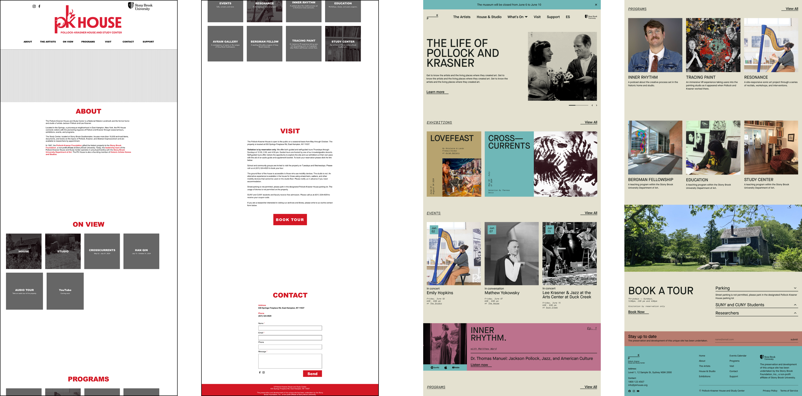

## Introduction

Located in Springs, New York, the Pollock-Krasner House and Study Center (PK House) is a National Historic Landmark and the former home and studio of artists Jackson Pollock and Lee Krasner.

The PK House needed a more sustainable way to manage and evolve its digital presence. The existing website, originally built in-house using a limited website builder, lacked the flexibility and functionality required to support the center’s growing editorial and operational needs.

At [Made by Sea](https://www.madebysea.com), we worked on a broader rebranding initiative for the Pollock-Krasner House, which I contributed to. My primary focus within the project was the web experience: designing and developing a scalable design system and CMS architecture, along with front-end implementation, that enabled non-technical staff to independently create, update, and manage content while maintaining consistency across the site. I also ensured a clear and intuitive user experience for visitors, making it easy to access and engage with the content.

## Problem Statement

How might we design a website management system that empowers museum staff with full autonomy to create and manage new web pages, while ensuring the platform remains clear, intuitive, and accessible for visitors?

## How I Contributed

I documented requirements, iterated on the sitemap, and helped define the project scope, while also contributing to the design system, component architecture, CMS structure, scalable content modules, and implementation guidelines to ensure consistency and long-term maintainability.

## Sitemap

## Spacing, Icons and Colors

## Typography

## Wireframes

To explore the wireframes in more detail, please refer to the [Figma file](https://www.figma.com/design/bi45COsUoJnTZ91zghOng9/Portfolio?node-id=21-4368). 

## Before & After

## Development

This project is built with a modern frontend stack using Next.js for a performant and scalable React application, and DatoCMS as a flexible headless CMS to manage and structure content. The interface is designed using the Atomic Design methodology, ensuring a modular and reusable component system that scales consistently across the site. The application is deployed on Vercel, enabling fast, reliable hosting with streamlined continuous deployment.

- **Next JS**
  - Fetches and renders content dynamically and statically where needed. I’ve also used Typescript and Graphql.
- **Dato CMS**
  - Serves as the central source of truth for content. Staff can create new pages using predefined sections and manage events.
- **Vercel**
  - Hosted on Vercel for seamless deployment from Git and to see previews for content and feature changes.
- **Git**
  - Worked with production and staging branches to support a structured workflow and enable effective collaboration within a team environment.

You can view the live project at [pkhouse.org](https://www.pkhouse.org)

## Components folder Structure

## CSS Strategy

This project follows the Atomic Design methodology, starting with design tokens as the foundation for colors, spacing, and typography. Global and layout styles build consistent structure across the app, while component-level CSS is applied individually to create modular, reusable UI pieces.

- **Tokens**
  - Contains design tokens such as CSS variables for colors, spacing, typography scales, etc. It acts as the single source of truth for the design system, enabling consistent theming and easy updates
- **Layout**
  - Handles structural and layout-related styles, such as grid systems, flex utilities, containers, breakpoints, and page-level layout patterns. It focuses purely on composition rather than visual identity or theming.
- **Globals**
  - Defines global styles and base defaults for the entire application, including resets, typography rules, body styling, and foundational element styles. It ensures a consistent baseline across all pages.

## CMS Structure

## Conclusion
The redesigned platform significantly improved how the Pollock-Krasner House manages and presents its digital content. Staff reported a smoother and more intuitive content management experience, allowing them to independently publish and update exhibitions and editorial content with greater ease.

In 2025, the website reached over 15,000 users, compared to just 1,600 in the previous year, reflecting increased accessibility and engagement with the center’s work.

Beyond immediate usability improvements, the new design system and CMS architecture established a scalable foundation for future growth, enabling the team to expand and evolve the site without technical constraints.

