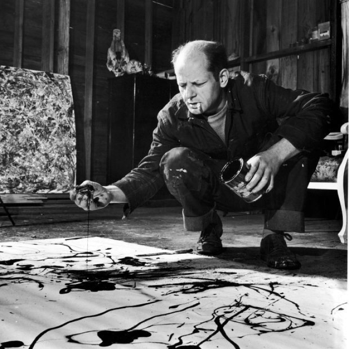
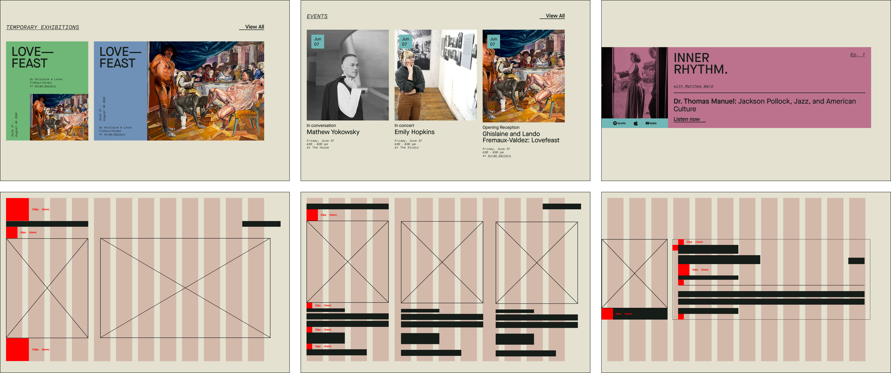

## Introduction

Located in Springs, New York, the Pollock-Krasner House and Study Center (PK House) is a National Historic Landmark and the former home and studio of artists Jackson Pollock and Lee Krasner.

The PK House needed a more sustainable way to manage and evolve its digital presence. The existing website, originally built in-house using a limited website builder, lacked the flexibility and functionality required to support the center’s growing editorial and operational needs.

At [Made by Sea](https://www.madebysea.com), we worked on a broader rebranding initiative for the Pollock-Krasner House, which I contributed to. My primary focus within the project was the web experience: designing and developing a scalable design system and CMS architecture, along with front-end implementation, that enabled non-technical staff to independently create, update, and manage content while maintaining consistency across the site. I also ensured a clear and intuitive user experience for visitors, making it easy to access and engage with the content.

## Problem Statement

How might we design a website management system that empowers museum staff with full autonomy to create and manage new web pages, while ensuring the platform remains clear, intuitive, and accessible for visitors?

## How I Contributed

I documented requirements, iterated on the sitemap, and helped define the project scope, while also contributing to the design system, component architecture, CMS structure, scalable content modules, and implementation guidelines to ensure consistency and long-term maintainability.

## Sitemap

## Spacing, Icons and Colors

## Typography

## Wireframes

To explore the wireframes in more detail, please refer to the [Figma file](https://www.figma.com/design/bi45COsUoJnTZ91zghOng9/Portfolio?node-id=21-4368). 

